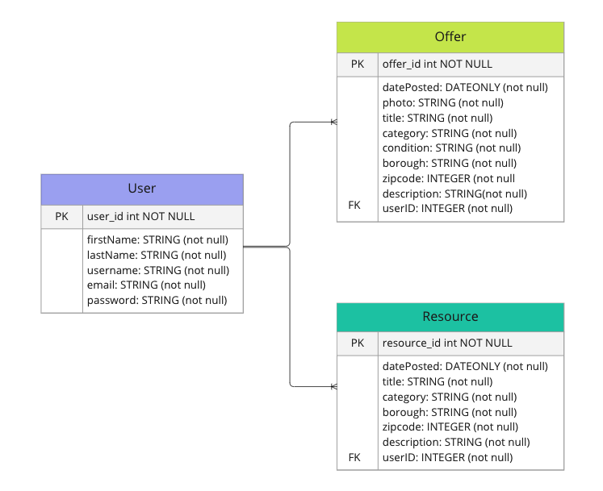
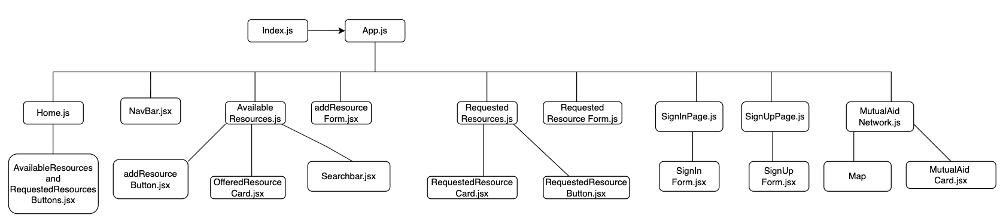

# communal care
#### 09/01/2022
#### yangtsel sherap

**[production website](LINK HERE) | [backend repo](https://github.com/y-sherap/communalcare) | [trello](https://trello.com/invite/b/Sm4ThAvO/7c9596bd5ad7858fbdfc4015dc7560dd/communal-care) |  [linkedin](https://www.linkedin.com/in/ysherap/)**

---

---

#### *overview*

Built with the intention of fostering cooperation and solidarity, communalcare allows members to freely share resources and services with their community. This non-transactional relationship is rooted in the practice of building new social relations that transcend mainstream social and economic paradigms.

***
* React
* Sequelize
* PostGreSQL
* Node.JS
* JSON Web Token
* Javascript
* HTML5
* CSS

***

#### *get started*
1. fork and clone
2. npm i
---

#### *screenshots*

##### *entity relationship diagram*

##### *component hierarchy diagram*

---

#### *future updates*
- [ ] dynamic map that shows existing mutual aid groups across nyc
- [ ] dynamic chart that shows requested resources overtime
- [ ] in-app messaging system that allows users to message each other
---

#### *resources*

- Draw.io
- Heroku
- Miro
